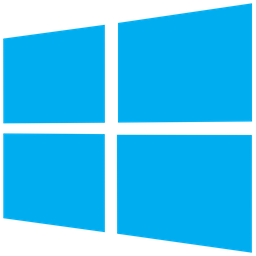

<div align="center">
  <h1>Orbolay</h1>
  <p>Quick, small, native, multi-platform Discord overlay alternative</p>
</div>

<div align="center">
  
  
  
</div>

<div align="center">
  <a href="https://discord.gg/agQ9mRdHMZ"></a>
  
</div>

<div align="center">
  
</div>

# Downloads

<table align="center">
  <tr>
    <th>
      
    </th>
    <th>
      
    </th>
    <th>
      
    </th>
    <th>
      
    </th>
  </tr>

  <tr>
    <td width="23%">
      <div align="center">
        <a href="https://github.com/SpikeHD/Orbolay/releases/latest/download/orbolay-x86_64-pc-windows-msvc.exe">x86_64</a>
      </div>
    </td>
    <td width="23%">
      <div align="center">
        <a href="https://github.com/SpikeHD/Orbolay/releases/latest/download/orbolay-x86_64-apple-darwin.app.zip">x86_64 (Intel)</a>
        <span>|</span>
        <a href="https://github.com/SpikeHD/Orbolay/releases/latest/download/orbolay-aarch64-apple-darwin.app.zip">ARM64 (M-series)</a>
      </div>
    </td>
    <td width="23%">
      <div align="center">
        <a href="https://github.com/SpikeHD/Orbolay/releases/latest/download/orbolay-x86_64-unknown-linux-gnu.deb">.deb (x86_64)</a>
      </div>
    </td>
    <td width="23%">
      <div align="center">
        <a href="https://github.com/SpikeHD/Orbolay/releases/latest/download/orbolay-x86_64-unknown-linux-gnu">x86_64</a>
        <span>|</span>
        <a href="https://github.com/SpikeHD/Orbolay/releases/latest/download/orbolay-x86_64-unknown-linux-gnu.AppImage">AppImage (x86_64)</a>
      </div>
    </td>
  </tr>
</table>


# Table of Contents

* [Features](#features)
* [Compatibility](#compatibility)
* [Installation](#installation)
  * [With Package Managers](#with-package-managers)
    * [Windows (scoop)](#windows-scoop)
    * [Arch](#arch)
    * [Void](#void)
    * [`cargo`](#cargo)
  * [Manual Installation](#manual-installation)
* [How to Use](#how-to-use)
  * [With Official Clients](#with-official-clients)
  * [With Modded Clients](#with-modded-clients)
* [Using as a Wrapper Process](#using-as-a-wrapper-process)
* [Configuration](#configuration)
* [Other Notes](#other-notes)
  * [Hyprland](#hyprland)
* [Building](#building)
  * [Requirements](#requirements)
  * [Steps](#steps)
* [Special Thanks](#special-thanks)
* [Contributing](#contributing)

# Features

* Voice channel member list and status (who is speaking/muted/deafened/etc)
* Custom notifications
* Mute/deafen/disconnect controls
* User volume control
* Soundboard
* Customizable layout, colors, border radius, etc.
* Works with any official or modded client (including web!)

# Compatibility

* **Windows** - 10 and 11 both work, Windows 7 might work with kernel extensions
* **MacOS** - works, but cannot watch for keybinds (which means no voice controls)
* **Linux**
  * **X11** - should work fine, you may need to add your user to the `input` group
  * **Wayland** - technically works, you will want to use XWayland though (via `WAYLAND_DISPLAY="" orbolay`) and you may need to add your user to the `input` group

# Installation

## With Package Managers

> [!WARNING]
> I **DO NOT** maintain Orbolay packages myself, but some kind people maintain them on their own spare time. Check the package repository for yourself if you are skeptical of it's legitimacy!

> [!NOTE]
> Maintaining an `orbolay` package somewhere else? Let me know in an issue and I will add it here!

### Windows (scoop)
```sh
scoop bucket add turbo 'https://github.com/Small-Ku/turbo-bucket.git'
scoop install turbo/orbolay
```

### Arch
```sh
yay -S orbolay-git
```

### Void
```sh
echo "repository=https://void.creations.works" | sudo tee /etc/xbps.d/creations.conf
sudo xbps-install -S orbolay
```

### `cargo`
```sh
cargo install --locked --git https://github.com/SpikeHD/Orbolay.git
```

## Manual Installation

1. Download a [release](https://github.com/SpikeHD/Orbolay/releases) or the [latest actions build](https://github.com/SpikeHD/Orbolay/actions/workflows/build.yml).
2. Run the executable!

# How to Use

## With Official Clients

With Discord open:

1. Run the executable
2. Press <kbd>Ctrl</kbd> + <kbd>`</kbd> to open the overlay and interact with voice controls

## With Modded Clients

With your client open:

1. Install a compatible bridge plugin ([Shelter](https://github.com/SpikeHD/shelter-plugins?tab=readme-ov-file#orbolay-bridge) / [Vencord](https://github.com/SpikeHD/vc-orbolay-bridge), also available on [Equicord](https://github.com/Equicord/Equicord))
2. Run the executable
3. In the [configuration menu](#configuration), change "Connection Mode" to `websocket`
4. Press <kbd>Ctrl</kbd> + <kbd>`</kbd> to open the overlay and interact with voice controls

# Using as a Wrapper Process

Orbolay also works as a process wrapper, allowing you to have it only open when you run certain games. In Steam, for example, you
can have Orbolay run when your game launches by setting this as your launch options (combined with whatever other options
you may be using):

```sh
orbolay -- %command%
```

# Configuration

On first run, Orbolay should open the configurator automatically. In the future, it can be opened in two ways:

1. Open the overlay, then press "C"
2. Run `orbolay --config` in any terminal

# Other Notes

## Hyprland

To use Orbolay with Hyprland, you will need to manually set some window rules (taken from [#28](https://github.com/SpikeHD/Orbolay/issues/28)). Note that this prevents the keybind and clickable controls from working:

```
hl.window_rule({
    match = {title = "^(orbolay)$"},
    no_initial_focus = true,
    suppress_event = "activatefocus",
    float = true,
    pin = true,
    center = true,
    no_blur = true,
    no_dim = true,
    no_follow_mouse = true,
    no_shadow = true,
    border_size = 0,
    no_focus = true,
    move = {"monitor_w", "monitor_h"},
    size = {"monitor_w - 5", "monitor_h - 5"}
})
```

# Building

## Requirements

* Rust and Cargo

## Steps

1. Clone the repository
2. `cargo build --release`
3. Binaries will be in `target/release/`

# Special Thanks

* [Freya](https://github.com/marc2332/freya) - the main GUI library (that I may have fallen in love with)
* [Discover](https://github.com/trigg/Discover) - a fantastic reference for some of the IPC-related stuff
* [docs.discord.food](https://docs.discord.food/) - incredible reference for undocumented Discord APIs
* The [Twemoji Alpine Package](https://pkgs.alpinelinux.org/package/edge/community/x86/font-twemoji) - contains a proper CBDT Twemoji font file that I've extracted for use here
* Everyone else who contributes positively to the Rust ecosystem :)

# Contributing

PRs (especially for compatibility), polite issues, etc. are all welcome!
